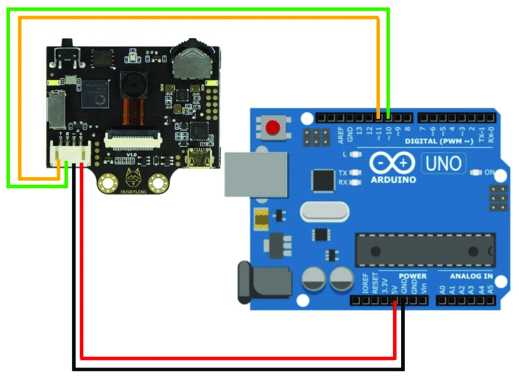
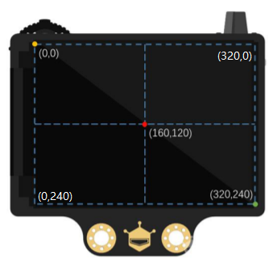

# HuskyLens
Utilisation de la caméra HuskyLens pour détecter une balle

## Comment utiliser la caméra HuskyLens sur arduino ?

### 1. Câblage :

 - Vous devez brancher le **<ins>pin T</ins>** (TX) sur le pin **11**, brancher le **<ins>pin R</ins>** (RX) sur le pin **10**, brancher le **<ins>pin GND</ins>** (ground soit le fil terre à 0V, la borne -) sur le pin **GND** et pour finir brancher le **<ins>pin VCC</ins>** (tension continu en Volt, la borne +) sur le pin **5V**. Regarder l'image pour vous aidez.   
      

   
   
> [!WARNING]
> Fais vérifier ton câblage à ton prof avant de brancher ta carte arduino.

### 2. Fonctionnement des boutons et des coordonées sur la caméra HuskyLens :

- Tu peux changer de mode avec la roulette en la tournant à droite ou à gauche, tu peux appuyer sur la roulette pour sélectionner le mode que tu souhaites. Le bouton permet d'apprendre ou oublier l'objet enregistrer précedemment. 

- Lorsque la caméra détecter un objet, la cible est placer sur le système de coordonnées suivant.

  

> [!NOTE]
> Les coordonées sont ceux pour la caméra donc pour savoir la distance à laquelle se situe l'objet il va falloir opter pour certaines techniques.

