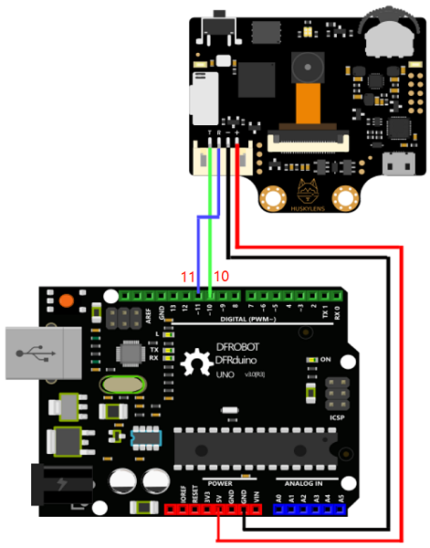

# HuskyLens
Utilisation de la caméra HuskyLens pour détecter une balle

## Comment utiliser la caméra HuskyLens sur arduino ?

### 1. Câblage :

 - Vous devez brancher le **<ins>pin T</ins>** (TX) sur le pin **11**, brancher le **<ins>pin R</ins>** (RX) sur le pin **10**, brancher le **<ins>pin GND</ins>** (ground soit le fil terre à 0V, la borne -) sur le pin **GND** et pour finir brancher le **<ins>pin VCC</ins>** (tension continu en Volt, la borne +) sur le pin **5V**. Regarder l'image pour vous aidez.   
      


   
   
> [!WARNING]
> Fais vérifier ton câblage à ton prof avant de brancher ta carte arduino.

### 2. Fonctionnement des boutons et des coordonées sur la caméra HuskyLens :

- Tu peux changer de mode avec la roulette en la tournant à droite ou à gauche, tu peux appuyer sur la roulette pour sélectionner le mode que tu souhaites. Le bouton permet d'apprendre ou oublier l'objet enregistrer précedemment. 


- Lorsque la caméra détecter un objet, la cible est placer sur le système de coordonnées suivant.


  

> [!NOTE]
> Les coordonées sont ceux pour la caméra donc pour savoir la distance à laquelle se situe l'objet il va falloir opter pour certaines techniques.

## Programmation  Arduino

### 1. Installation :

Veuillez d'abord télécharger et installer la [bibliothèque HUSKYLENS](https://codeload.github.com/HuskyLens/HUSKYLENSArduino/zip/master)  

- Installer la bibliothèque  :
  
   - Décompressez le fichier, puis copiez le dossier dans le dossier « bibliothèques » de l'IDE Arduino. Vérifiez ensuite si le nom du dossier est « HUSKYLENS ». Sinon, veuillez le remplacer par "HUSKYLENS". Veuillez noter que le nom du fichier de bibliothèque doit être HUSKYLENS.     
     
    

  - Tous les fichiers .h et .cpp doivent se trouver dans le répertoire racine du dossier « HUSKYELSN ».
  
    
### 2. Lire les données de position

- Ouvrir Arduino, ouvrer l'exemple en allant dans : **File > Example > HUSKYLENS > HUSKYLENS_GET_STARTED**, vous devriez avoir quelque chose ressemblant à ça :
   ```c++
   #include "HUSKYLENS.h"
   #include "SoftwareSerial.h"

  HUSKYLENS huskylens;
  SoftwareSerial mySerial(10, 11); // RX, TX
  //HUSKYLENS green line >> Pin 10; blue line >> Pin 11
  void printResult(HUSKYLENSResult result);
  
  void setup() {
      Serial.begin(115200);
      mySerial.begin(9600);
      while (!huskylens.begin(mySerial))
      {
          Serial.println(F("Begin failed!"));
          Serial.println(F("1.Please recheck the \"Protocol Type\" in HUSKYLENS (General Settings>>Protocol Type>>Serial 9600)"));
          Serial.println(F("2.Please recheck the connection."));
          delay(100);
      }
  }
  
  void loop() {
      if (!huskylens.request()) Serial.println(F("Fail to request data from HUSKYLENS, recheck the connection!"));
      else if(!huskylens.isLearned()) Serial.println(F("Nothing learned, press learn button on HUSKYLENS to learn one!"));
      else if(!huskylens.available()) Serial.println(F("No block or arrow appears on the screen!"));
      else
      {
          Serial.println(F("###########"));
          while (huskylens.available())
          {
              HUSKYLENSResult result = huskylens.read();
              printResult(result);
          }    
      }
  }
  
  void printResult(HUSKYLENSResult result){
      if (result.command == COMMAND_RETURN_BLOCK){
          Serial.println(String()+F("Block:xCenter=")+result.xCenter+F(",yCenter=")+result.yCenter+F(",width=")+result.width+F(",height=")+result.height+F(",ID=")+result.ID);
      }
      else if (result.command == COMMAND_RETURN_ARROW){
          Serial.println(String()+F("Arrow:xOrigin=")+result.xOrigin+F(",yOrigin=")+result.yOrigin+F(",xTarget=")+result.xTarget+F(",yTarget=")+result.yTarget+F(",ID=")+result.ID);
      }
      else{
          Serial.println("Object unknown!");
      }
  }

   ```
- Vérifier la carte (**Tools > Board >** saisir la bonne carte) et port sur arduino, en allant dans **Tools >  Port >** et saisir son port, compiler le programme et ouvrer le **"Serial Monitor"**
  
